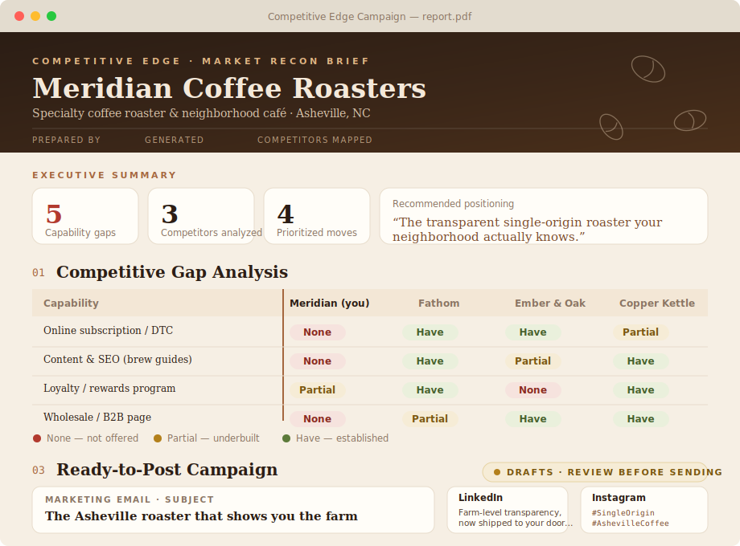

# Competitive Edge Campaign Builder

An n8n workflow that turns one company URL into a competitor gap analysis **and** a ready-to-post
ad campaign, delivered as a polished PDF.

You give it a company. A few minutes later you get an email with a designed **PDF report** that shows
where that company is losing to its competitors and hands you a full ad campaign to fix it — all
generated automatically. Nothing is posted or sent to customers without your review.

## Preview

Illustrative mockup of the delivered PDF — the gap-analysis matrix (None / Partial / Have per
competitor), the recommended positioning, and the ready-to-post campaign. The report **auto-themes
to the company's industry**; this is the `cozy_warm` coffee preset. Standalone HTML previews of the
real design live in [`templates/`](templates/) — open them in a browser, or render a live report by
importing the workflow and submitting a URL.

## How it works

1. **You submit a company website** in a simple web form (the workflow's built-in form trigger).
2. **It reads the company's own site** and figures out what the business is and what to search for.
3. **It finds real competitors** with a keyless web search, then reads each competitor's site.
4. **AI analyzes the gaps** — where the company trails its rivals — and writes prioritized
   recommendations plus a positioning angle (Google Gemini does the reasoning).
5. **AI writes the campaign** — a marketing email + LinkedIn, X, and Instagram posts with hashtags.
6. **A themed report is built** that automatically re-skins to match the company's industry
   (a coffee shop gets a warm, cozy look; a SaaS gets a clean modern one; etc.).
7. **You get an email** with a short summary of the findings and the **full report attached as a PDF**.

Everything is a **draft for human review** — the tool never posts to social media or emails customers.

## Built with (all free-tier friendly)

- **n8n** — the workflow engine (self-hosted or cloud)
- **Google Gemini** — the AI writing/analysis (free Google AI Studio key)
- **DuckDuckGo** — competitor discovery (no API key needed)
- **PDFShift** — turns the HTML report into a PDF (free tier)
- **Gmail** — sends the finished report

## Run it

1. In n8n: **Import from File** → [`n8n/competitive_edge_campaign.workflow.json`](n8n/competitive_edge_campaign.workflow.json).
2. Add three credentials: **Google Gemini** (on the *Gemini* node), **PDFShift** (Header Auth,
   `X-API-Key`, on the *Render PDF* node), and **Gmail** (on the *Email Report* node).
3. Activate the workflow, open the form's URL, and submit a company. The report lands in your inbox.

Full step-by-step + design notes: [`workflows/competitive_edge_campaign.md`](workflows/competitive_edge_campaign.md).

## How the project is organized

The workflow JSON is generated from small, readable source files so it's easy to edit:

- `n8n/code/` — the JavaScript for each processing step (URL cleanup, scraping, competitor
  extraction, report + PDF assembly)
- `n8n/prompts/` — the AI prompts (company profile, gap analysis, campaign copy)
- `n8n/schemas/` — example JSON shapes that keep the AI's output structured
- `n8n/build_workflow.js` — assembles all of the above into the importable workflow
  (`node build_workflow.js` regenerates `competitive_edge_campaign.workflow.json`)
- `templates/` — standalone HTML previews of the report design (open in a browser)

---

_No secrets are committed — API keys live only in your n8n credentials, never in this repo. All
generated marketing copy is a draft for human review._
